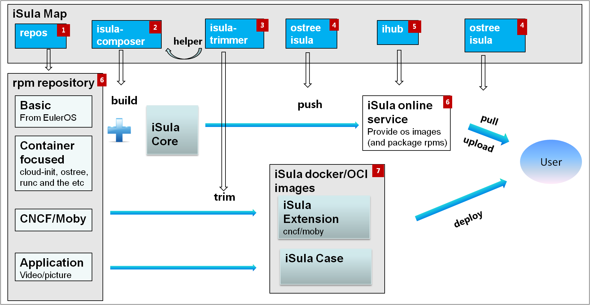

# Home

This is the home of the EulerOS iSula community, it provides the whole picture.

## Table of Contents
- [Map](#map)
- [Projects](#projects)
- [Services](#services)
- [Container Images](#images)
- [How to participate](#how-to-participate)

## Map


## Projects

The iSula community contains many projects, simply we can divided them into three categories:
1. from upstream, not modified
   We won't fork them and we will package them.
2. from upstream, modified
   We will fork them and try our best to send patches upstream.
   For patches that cannot/is-not accepted by upstream, we will put them to a `isula` branch.
   That will be a 'shadow branch'.
3. start by iSula community
   We will definitly host them in this github account.
   Hopefully they can be accepted by open-source foundations, it will be our honor to donate them.

### Repos

The rpm package repositories are the source of the iSula.
We will package them in [Repos](https://github.com/isula/repos).
We have [online repository service](http://isulahub.com:8081/repo) to make packages avaiable to users/developers.

Any new package requirement will/should be sent to this project.

### [isula-composer](https://github.com/isula/isula-composer)

The tool to build an isula operation system.

### [isula-trimmer](https://github.com/isula/isula-trimmer)

The tool to cut off the unnecessary packages in order to make a slim os or container image. 
It also helps the `isula-composer` user to write a clean configuration file.

### [ihub](https://github.com/isula/ihub)

This is a universal protocol server, mainly for package repository and os server.
It could also be used to support docker or oci(if exist) protocol.

### ostree

Not started yet, it will be isula-enhanced.

## Services

Package repository and os server are the two main online services.
Both of them are supported by the `ihub` project.

## Images

We collect container images based on [EulerOS Base Image](https://github.com/euleros/euleros-docker-images).
Either of them are CNCF services or user cases.
The images will be stored on `docker.io/isula`.

## How to participate

The community welcomes any ideas and submissions, but please let everyone know what you are working on.
This help iSula to getting better.

- If you have a good idea of create a new project, please report an [issue](https://github.com/isula/repos/issues/new).
- If you have suggestion or complain about community governance, please also report an [issue](https://github.com/isula/repos/issues/new).
- Any topic related to a specific project should be discussed there directly. 

### Meetings

Since our community is not big enough, we don't have a periodic global meeting currently.
But we do have a Wechat group to discuss the community affairs and somethings we will call others directly.
If anyone want to start a meeting, please contact David Liang <liangchenye@gmail.com>.

### Find iSula

- [twitter](https://twitter.com/eulerosisula)
- [weblog](https://weibo.com/eulerosisula)
- Wechat official account
  

### Git commit

#### Sign your work

The sign-off is a simple line at the end of the explanation for the patch, which certifies that you wrote it or otherwise have the right to pass it on as an open-source patch.
The rules are pretty simple: if you can certify the below (from http://developercertificate.org):

```
Developer Certificate of Origin
Version 1.1

Copyright (C) 2004, 2006 The Linux Foundation and its contributors.
660 York Street, Suite 102,
San Francisco, CA 94110 USA

Everyone is permitted to copy and distribute verbatim copies of this
license document, but changing it is not allowed.


Developer's Certificate of Origin 1.1

By making a contribution to this project, I certify that:

(a) The contribution was created in whole or in part by me and I
    have the right to submit it under the open source license
    indicated in the file; or

(b) The contribution is based upon previous work that, to the best
    of my knowledge, is covered under an appropriate open source
    license and I have the right under that license to submit that
    work with modifications, whether created in whole or in part
    by me, under the same open source license (unless I am
    permitted to submit under a different license), as indicated
    in the file; or

(c) The contribution was provided directly to me by some other
    person who certified (a), (b) or (c) and I have not modified
    it.

(d) I understand and agree that this project and the contribution
    are public and that a record of the contribution (including all
    personal information I submit with it, including my sign-off) is
    maintained indefinitely and may be redistributed consistent with
    this project or the open source license(s) involved.
```

then you just add a line to every git commit message:

    Signed-off-by: Joe Smith <joe@gmail.com>

using your real name (sorry, no pseudonyms or anonymous contributions.)

You can add the sign off when creating the git commit via `git commit -s`.

#### Commit Style

Simple house-keeping for clean git history.
Read more on [How to Write a Git Commit Message][how-to-git-commit] or the Discussion section of [git-commit(1)][git-commit.1].

1. Separate the subject from body with a blank line
2. Limit the subject line to 50 characters
3. Capitalize the subject line
4. Do not end the subject line with a period
5. Use the imperative mood in the subject line
6. Wrap the body at 72 characters
7. Use the body to explain what and why vs. how
    * If there was important/useful/essential conversation or information, copy or include a reference
8. When possible, one keyword to scope the change in the subject (i.e. "README: ...", "runtime: ...")


[how-to-git-commit]: http://chris.beams.io/posts/git-commit
[git-commit.1]: http://git-scm.com/docs/git-commit
