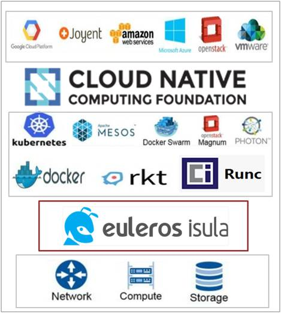

# Background

Huawei is driving to Cloud Native applications, which brings major challenges to traditional server OSs.
These challenges include diverse devices, containerized applications, microservices, IoT infrastructures,
edge computing, and large-scale modern data centers. For example, the server OSs of modern data centers
urgently need simplification and easy management. In response to this trend, Huawei developed EulerOS iSula, 
an open-source container-based OS. This project will enable Huawei to explore flexible build processes,
rapid deployment, high availability, and trusted security technologies. It will also facilitate cooperative
efforts between Huawei and partners in the open-source community toward developing a mature and containerized OS.

# How iSula Operates in the Open-Source Community

Various iSula resources are available from the iSula GitHub account: https://github.com/isula
iSula also has a Twitter account, where you can follow the latest developments: https://twitter.com/eulerosisula

 

## Why it names 'isula'

In Latin, "isula" means "island". Historically, it refers to the city of Rome. 
The OS's logo pays homage to another meaning of "isula" — a type of ant found in the Amazon jungle. 
It is also known as the "bullet ant", due to its intensely painful bite. The isula is one of the most formidable insects in the world.

As a lightweight container-based OS, iSula can provide the most flexible, reliable, and secure support
for efficiently maintaining the underlying infrastructure of a cloud platform. Like its bullet-ant namesake,
iSula is small in size but packs a huge punch. Equally, just like ants working together for the good of the colony,
iSula aims to take an active role in the open-source community.

## How the community structed

In cloud computing scenarios, iSula provides full-stack container-based solutions for cloud services and establishes
an open-source community around it to attract global developers and partners, building a well-designed ecosystem.
The open-source community is developing software stack solutions focusing on three aspects:

### iSula Core

  Basic system version, which can be directly deployed and used. iSula Core is updated every half year. The iSula community
  provides a community software repository to maintain packages, such as OSTree, Docker and runC.

### iSula Extension

  Easy-to-use cloud expansion, which is an iSula Core–based expansion solution,
  can help users (including O&M personnel) deploy Cloud Native applications.
  For example, the isula-cncf-extension solution integrates the latest CNCF official projects, facilitating the deployment 
  of CNCF integration solutions.

### iSula Case

  Provides multiple application solutions. Each cloud application forms an iSula Case after being fully verified 
  by the iSula community. The iSula community collects diverse application solutions through community cooperation to 
  meet the requirements of users (including application vendors).

# iSula Development

EulerOS iSula is an OS built for containers running in the cloud. iSula targets data centers and cloud users.
- Supports customization to create the most streamlined system, with fast atomic upgrade and rollback.
-	Compatible with bottom-layer hardware, providing RESTful APIs to the upper layer for resource management.
-	In complex Huawei cloud environments, customers have very high demands on security. With iSula, containers
   run on the software- and hardware-hardened OS, ensuring service security.
-	iSula is a 100% open-source community project. System developers can contribute to this project at https://github.com/isula.

## Description

Driven by the wave of cloud-native applications, future cloud platforms will be built to be scalable, reliable, 
and secure for easy O&M. iSula has been consciously designed with these aspects in mind, and has made strides in the following areas:
-	Flexible deployment
  The automated build tool is available for system developers to customize a simplified system based on software and hardware 
  requirements. iSula is smaller and faster to start than traditional container OS offerings, maximizing system deployment performance.
  With the isula-composer tool, customers can customize to create a streamlined system that meets their unique needs.
  As an established industry leader in ICT, Huawei offers a full range of hardware products, including chips, servers, 
  and storage devices, which provide hardware compatibility support for iSula in version development.
- Efficient O&M
  Using the OSTree technology, O&M personnel can perform atomic dark launch and rollback in large scale cloud environments.
  For better management of system resources, iSula provides RESTful APIs and a visualized management interface.
  Traditional package management systems are not developer-friendly due to software package dependencies.
  Adding a container layer helps get rid of the dependencies, delivering application deployment and maintenance in a consistent way.
  This layered concept is used in iSula to simplify the whole management system and enable atomic system upgrade and rollback. 
  In a cloud environment, technical personnel can perform group-based batch upgrade or rollback. This pattern guarantees service 
  continuity. In addition, RESTful APIs are provided to facilitate resource configuration and management.
-	Security and reliability
  Container security is always a major concern. For this purpose, iSula provides scanning of base images, trusted boot,
  and interconnection with the trusted platform module (TPM). Security is always a major priority for Huawei. For container security,
  iSula has made the following advances: 
    - Security of base images
      This requires that the iSula system has a sound loophole scanning mechanism to detect common vulnerabilities and 
      exposures (CVE) in base images without any delay.
    - Trusted boot
      This ensures that illegal modifications are identified in time during system boot to enhance the security of cloud services.
    - Secure boot
      Interconnecting with the TPM, iSula supports integrity measurement of OSs, container engines, and container images, 
      ensuring they can withstand malicious tampering.
